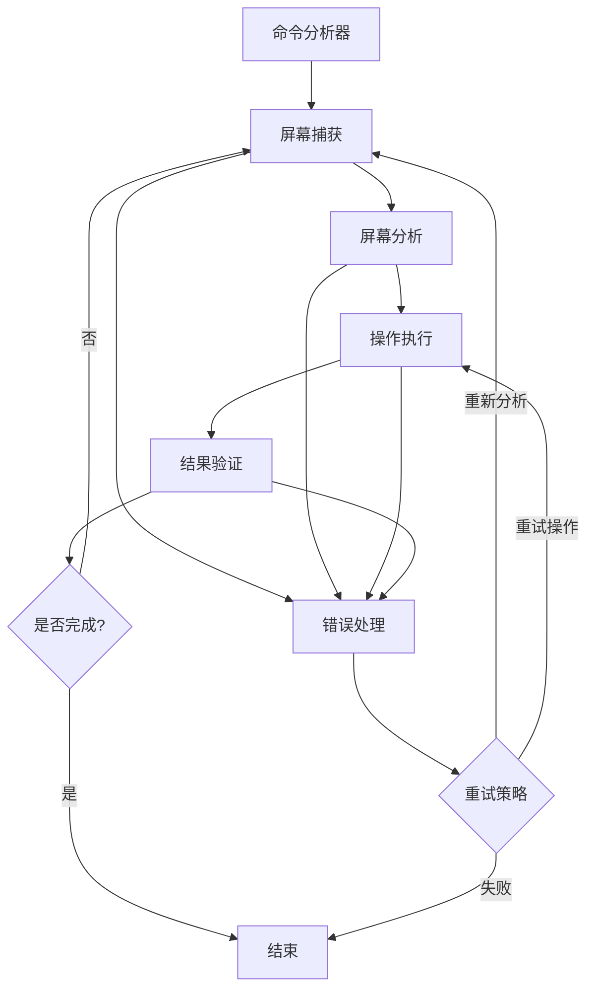

# Mac Vision Agent - LangGraph版本

## 概述

这是使用LangGraph重构的Mac视觉智能体，提供了更强大的工作流编排能力、更好的错误处理和状态管理。

## 架构对比

### 原始架构（CrewAI）
- 基于CrewAI的多智能体框架
- 线性任务执行流程
- 有限的错误处理和重试机制
- 状态管理分散在各个组件中

### LangGraph架构
- 基于状态图的工作流编排
- 支持条件分支、循环和复杂流程控制
- 统一的状态管理和检查点机制
- 强大的错误恢复和重试策略
- 更好的可观测性和调试能力

## 核心组件

### 1. 状态管理 (`langgraph_core/state.py`)
- `VisionAgentState`: 统一的状态类型定义
- `ExecutionStep`: 执行步骤数据结构
- `ExecutionResult`: 执行结果数据结构
- `UIElement`: UI元素数据结构

### 2. 节点定义 (`langgraph_core/nodes/`)
- `command_analyzer_node`: 命令分析节点
- `screen_capture_node`: 屏幕捕获节点
- `screen_analyzer_node`: 屏幕分析节点
- `action_executor_node`: 操作执行节点
- `result_validator_node`: 结果验证节点
- `error_handler_node`: 错误处理节点

### 3. 边定义 (`langgraph_core/edges.py`)
- 条件分支逻辑
- 错误处理流程
- 重试策略路由

### 4. 图构建器 (`langgraph_core/graph.py`)
- `VisionAgentGraph`: 主图管理类
- 图的构建、编译和执行
- 检查点和状态历史管理

## 工作流程



## 安装和使用

### 1. 安装依赖

```bash
# 安装LangGraph版本的依赖
pip install -r requirements_langgraph.txt
```

### 2. 基本使用

#### 命令行模式

```bash
# 执行单个命令
python main_langgraph.py --command "打开Safari浏览器"

# 交互模式
python main_langgraph.py --interactive

# 调试模式
python main_langgraph.py --command "点击屏幕中央" --debug

# 异步模式
python main_langgraph.py --command "打开应用" --async

# 流式模式
python main_langgraph.py --command "执行任务" --stream
```

#### 编程接口

```python
from langgraph_core.graph import create_vision_agent_graph

# 创建图实例
config = {
    "max_retries": 3,
    "timeout": 30,
    "debug": True
}
graph = create_vision_agent_graph(config)

# 同步执行
result = graph.run("打开Safari浏览器")
print(result)

# 异步执行
import asyncio

async def main():
    result = await graph.arun("打开Safari浏览器")
    print(result)

asyncio.run(main())

# 流式执行
async def stream_example():
    async for chunk in graph.astream("执行复杂任务"):
        print(f"状态更新: {chunk}")

asyncio.run(stream_example())
```

### 3. 配置选项

```python
config = {
    "max_retries": 3,        # 最大重试次数
    "timeout": 30,           # 超时时间（秒）
    "debug": False,          # 调试模式
    "log_level": "INFO"      # 日志级别
}
```

## 高级功能

### 1. 状态检查点

LangGraph自动保存执行状态，支持：
- 任务中断后恢复
- 状态历史查询
- 调试和分析

```python
# 获取状态历史
history = graph.get_state_history(thread_id="your_thread_id")
for state in history:
    print(f"步骤: {state.step}, 状态: {state.values}")
```

### 2. 错误恢复策略

系统支持多种错误恢复策略：
- **重新分析屏幕**: 当UI元素识别失败时
- **重试当前步骤**: 当操作执行失败时
- **修改执行计划**: 当任务需要调整时

### 3. 并发和异步支持

- 完全支持异步操作
- 可以并发处理多个任务
- 流式输出实时状态

### 4. 可观测性

```python
# 获取图的可视化
mermaid_graph = graph.get_graph_visualization()
print(mermaid_graph)

# 调试模式下的详细日志
config = {"debug": True, "log_level": "DEBUG"}
graph = create_vision_agent_graph(config)
```

## 与原版本的兼容性

### 保留的组件
- `services/`: 所有服务层代码保持不变
- `tools/`: 工具函数继续使用
- `config/`: 配置管理保持兼容
- `utils/`: 工具函数保持不变

### 迁移指南

1. **现有代码**: 原有的`main.py`和`agent_manager.py`仍然可用
2. **新功能**: 使用`main_langgraph.py`体验新的LangGraph功能
3. **渐进迁移**: 可以逐步将现有逻辑迁移到LangGraph节点中

## 性能优势

### 1. 更好的错误处理
- 智能重试策略
- 状态恢复机制
- 详细的错误分析

### 2. 更强的扩展性
- 模块化节点设计
- 易于添加新功能
- 支持复杂工作流

### 3. 更好的调试体验
- 状态可视化
- 执行历史追踪
- 详细的日志记录

## 开发指南

### 添加新节点

```python
# 在 langgraph_core/nodes/ 中创建新节点
def my_custom_node(state: VisionAgentState, config: RunnableConfig) -> Dict[str, Any]:
    """自定义节点"""
    # 节点逻辑
    return {
        "custom_field": "value",
        "messages": [AIMessage(content="节点执行完成")]
    }

# 在图中添加节点
graph.add_node("my_custom_node", my_custom_node)
```

### 自定义边逻辑

```python
def custom_edge_condition(state: VisionAgentState) -> str:
    """自定义边条件"""
    if state.get('custom_condition'):
        return "next_node"
    else:
        return "alternative_node"

# 添加条件边
graph.add_conditional_edges(
    "source_node",
    custom_edge_condition,
    {
        "next_node": "next_node",
        "alternative_node": "alternative_node"
    }
)
```

## 故障排除

### 常见问题

1. **依赖安装失败**
   ```bash
   pip install --upgrade pip
   pip install -r requirements_langgraph.txt
   ```

2. **图编译错误**
   - 检查节点函数签名
   - 确保状态类型正确
   - 查看调试日志

3. **执行超时**
   - 增加timeout配置
   - 检查网络连接
   - 优化节点逻辑

### 调试技巧

```python
# 启用详细调试
config = {
    "debug": True,
    "log_level": "DEBUG"
}

# 查看图结构
print(graph.get_graph_visualization())

# 检查状态历史
history = graph.get_state_history(thread_id)
for state in history:
    print(state)
```

## 贡献指南

1. Fork项目
2. 创建功能分支
3. 添加测试
4. 提交PR

## 许可证

与原项目保持一致的许可证。