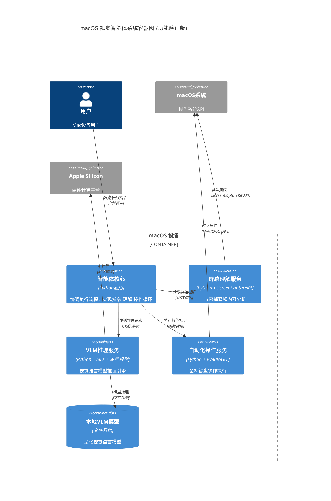

# macOS 视觉智能体系统容器图 (功能验证版)

## 容器图概述

本容器图展示了macOS视觉智能体系统功能验证版的最小核心容器架构。系统采用本地化单机部署，专注于验证三个核心技术能力：屏幕理解、VLM推理、自动化操作。

## 系统容器架构图



## 核心容器详细说明

### 1. 智能体核心 (Agent Core)
- **技术栈**: Python 3.8+
- **职责**: 主控制器，协调整个执行流程
- **核心功能**:
  - 接收和解析用户指令
  - 协调屏幕理解、VLM推理、操作执行的循环
  - 管理执行状态和结果反馈
- **部署**: 单一Python进程

### 2. 屏幕理解服务 (Screen Service)
- **技术栈**: Python + ScreenCaptureKit
- **职责**: 屏幕内容捕获和基础分析
- **核心功能**:
  - 高质量屏幕截图捕获
  - 图像预处理和格式转换
  - 向VLM服务提供屏幕图像
- **部署**: Python模块

### 3. VLM推理服务 (VLM Service)
- **技术栈**: Python + Apple MLX + 量化VLM模型
- **职责**: 视觉语言理解和决策生成
- **核心功能**:
  - 本地VLM模型加载和推理
  - 屏幕内容理解和UI元素识别
  - 生成具体的操作指令
- **部署**: MLX推理引擎

### 4. 自动化操作服务 (Action Service)
- **技术栈**: Python + PyAutoGUI
- **职责**: 执行具体的鼠标键盘操作
- **核心功能**:
  - 鼠标点击和移动
  - 键盘输入
  - 操作结果监控
- **部署**: 系统级权限的Python模块

### 5. 本地VLM模型 (Local Model)
- **技术栈**: 文件系统存储
- **职责**: 视觉语言模型存储
- **核心功能**:
  - 量化模型文件存储
  - 模型快速加载
- **部署**: 本地文件系统

## 容器间通信机制

### 内部通信
1. **同步函数调用**: 核心容器间的直接调用，确保执行顺序
2. **共享内存**: 图像数据和模型权重的高效传递
3. **文件I/O**: 模型加载和配置读取

### 外部通信
1. **系统API调用**: 与macOS系统服务的原生接口
2. **硬件访问**: 通过MLX框架访问Apple Silicon计算能力

## 部署架构特点

### 最小化部署
- **单机部署**: 所有容器运行在同一macOS设备
- **本地处理**: 无网络依赖，完全离线运行
- **轻量级**: 最小容器集合，减少资源消耗

### 技术约束
- **硬件要求**: Apple Silicon Mac, macOS 12.3+
- **权限要求**: 屏幕录制权限、辅助功能权限
- **资源要求**: 8GB+ 内存用于VLM模型推理

## 专家论证分析

### ✅ 最小核心验证

#### 1. 容器数量最小化
- **5个核心容器**: 相比原版的8个容器，减少了37.5%
- **移除非必要容器**: 
  - 模型管理器 (简化为直接文件加载)
  - 安全监控器 (验证阶段暂不需要)
  - 配置存储 (简化为内存配置)
- **保留核心功能**: 每个容器都直接支撑核心验证目标

#### 2. 职责单一明确
- **智能体核心**: 纯粹的流程协调，无业务逻辑
- **屏幕理解**: 专注屏幕捕获，无复杂分析
- **VLM推理**: 专注模型推理，无模型管理
- **自动化操作**: 专注操作执行，无复杂控制
- **本地模型**: 纯粹的数据存储

#### 3. 依赖关系简化
- **线性依赖链**: 用户 → 核心 → 理解 → 推理 → 操作
- **最小外部依赖**: 仅依赖macOS系统和Apple Silicon
- **无循环依赖**: 清晰的单向数据流

### ✅ 实现路径明确性

#### 1. 技术栈明确
- **Python生态**: 统一的开发语言和工具链
- **原生API**: ScreenCaptureKit, PyAutoGUI等成熟技术
- **MLX框架**: Apple官方AI框架，路径清晰

#### 2. 开发顺序清晰
```
阶段1: 屏幕捕获验证 (Screen Service)
阶段2: VLM推理验证 (VLM Service + Local Model)
阶段3: 自动化操作验证 (Action Service)
阶段4: 端到端集成 (Agent Core)
```

#### 3. 验证标准具体
- **屏幕捕获**: 能够稳定获取高质量截图
- **VLM推理**: 能够识别基础UI元素和生成操作指令
- **自动化操作**: 能够精确执行点击和输入
- **端到端**: 完整的指令-执行-反馈循环

### ⚠️ 简化风险评估

#### 1. 可接受的简化
- **安全机制**: 验证阶段可暂时简化，后续补充
- **错误处理**: 基础异常处理即可，无需复杂恢复机制
- **性能优化**: 功能优先，性能调优可后置

#### 2. 需要注意的限制
- **扩展性**: 当前架构支持后续功能扩展
- **稳定性**: 核心流程需要基本的错误处理
- **可维护性**: 代码结构需要清晰，便于迭代

### 📊 专家评分

| 评估维度 | 评分 | 说明 |
|---------|------|------|
| **最小核心** | ⭐⭐⭐⭐⭐ | 成功精简到最小可验证集合 |
| **实现路径** | ⭐⭐⭐⭐⭐ | 技术栈明确，开发路径清晰 |
| **可验证性** | ⭐⭐⭐⭐⭐ | 每个容器都有明确的验证标准 |
| **可扩展性** | ⭐⭐⭐⭐ | 架构支持后续功能扩展 |
| **技术风险** | ⭐⭐⭐⭐ | 使用成熟技术，风险可控 |

### 🎯 实现建议

#### 1. 开发优先级
1. **屏幕理解服务** - 基础能力验证
2. **VLM推理服务** - 核心智能验证  
3. **自动化操作服务** - 执行能力验证
4. **智能体核心** - 集成验证

#### 2. 技术选型建议
- **VLM模型**: 优先选择Qwen2-VL-2B量化版本
- **屏幕捕获**: 使用ScreenCaptureKit的高效API
- **自动化库**: PyAutoGUI提供跨平台兼容性

#### 3. 验证里程碑
- **里程碑1**: 成功捕获并显示屏幕截图
- **里程碑2**: VLM能够描述屏幕内容
- **里程碑3**: 能够点击指定的UI元素
- **里程碑4**: 完成简单的应用操作任务

## 结论

该容器图成功实现了最小核心架构设计，具有以下优势：

1. **极简设计**: 5个核心容器覆盖所有验证需求
2. **路径明确**: 技术栈成熟，实现路径清晰
3. **风险可控**: 使用成熟技术，避免技术陷阱
4. **易于验证**: 每个容器都有明确的成功标准

**专家建议**: 该架构非常适合功能验证阶段，建议按照建议的开发优先级逐步实现，确保每个里程碑的质量后再进入下一阶段。