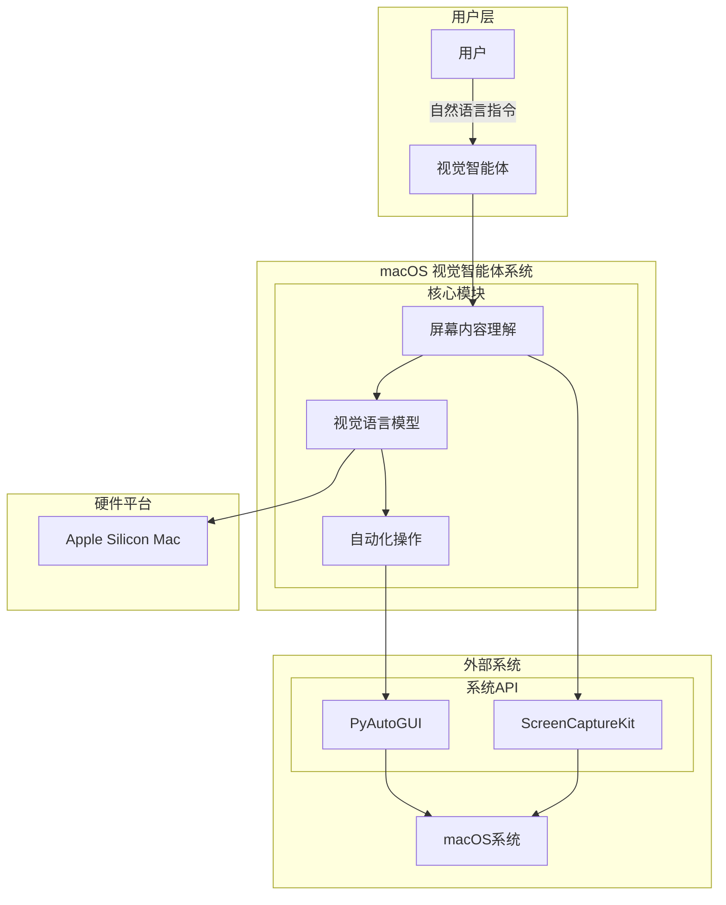

# macOS 视觉智能体系统上下文图 (功能验证版)

## 系统概述

这是一个**macOS 本地化视觉智能体系统**，专注于验证核心技术可行性。系统能够理解屏幕内容并执行基础的桌面自动化操作。

## 系统上下文图

## 系统边界分析

### 系统内部 (核心验证范围)
- **视觉智能体**: 协调整个执行流程
- **屏幕内容理解**: 捕获和分析屏幕信息
- **视觉语言模型**: 理解屏幕内容并生成操作指令
- **自动化操作**: 执行具体的鼠标键盘操作

### 系统外部 (依赖边界)
- **用户**: 提供任务指令
- **macOS系统**: 提供屏幕捕获和操作接口
- **Apple Silicon硬件**: 提供AI计算能力

## 关键接口

### 输入接口
- **用户指令**: 自然语言任务描述
- **屏幕内容**: 通过ScreenCaptureKit获取的屏幕图像

### 输出接口
- **系统操作**: 通过PyAutoGUI执行的鼠标键盘动作
- **执行反馈**: 任务完成状态

### 系统依赖
- **ScreenCaptureKit**: macOS原生屏幕捕获API
- **PyAutoGUI**: 跨平台GUI自动化库
- **本地VLM模型**: 视觉理解能力

## 技术约束

### 硬件约束
- Apple Silicon Mac设备
- macOS 12.3+

### 权限约束
- 屏幕录制权限
- 辅助功能权限

### 功能约束
- 本地处理，无网络依赖
- 基础操作验证 (点击、输入)
- 简单应用交互

## 专家审核评价

### ✅ 优点分析

1. **架构简洁**: 移除了非核心组件，专注于验证最小可行功能
2. **边界清晰**: 明确区分了系统内外边界，减少了复杂依赖
3. **技术聚焦**: 突出了三个核心技术验证点 (屏幕理解、VLM推理、自动化操作)
4. **实用导向**: 去除了过度设计，专注于可验证的功能

### ⚠️ 需要注意的简化

1. **安全机制简化**: 移除了故障安全机制，需在实际开发中补充
2. **模型管理简化**: 未详细展示模型加载和管理流程
3. **错误处理简化**: 缺少异常情况的处理机制

### 📊 整体评价

**适用性**: ⭐⭐⭐⭐⭐ (非常适合功能验证阶段)
**完整性**: ⭐⭐⭐ (核心功能完整，非核心功能精简)
**可实现性**: ⭐⭐⭐⭐⭐ (技术路径清晰可行)
**维护性**: ⭐⭐⭐⭐ (结构简单，易于理解和修改)

### 🎯 验证建议

1. **优先验证顺序**:
   - 屏幕捕获 → VLM理解 → 自动化操作 → 端到端集成

2. **最小验证场景**:
   - 捕获屏幕并识别计算器应用
   - 点击计算器按钮执行简单计算
   - 验证操作结果反馈

3. **成功标准**:
   - 能够稳定捕获屏幕内容
   - VLM能够识别基础UI元素
   - 能够精确执行点击操作
   - 完整的指令-执行-反馈循环

**结论**: 该系统上下文图成功地将复杂的智能体系统简化为核心验证要素，非常适合技术可行性验证阶段使用。